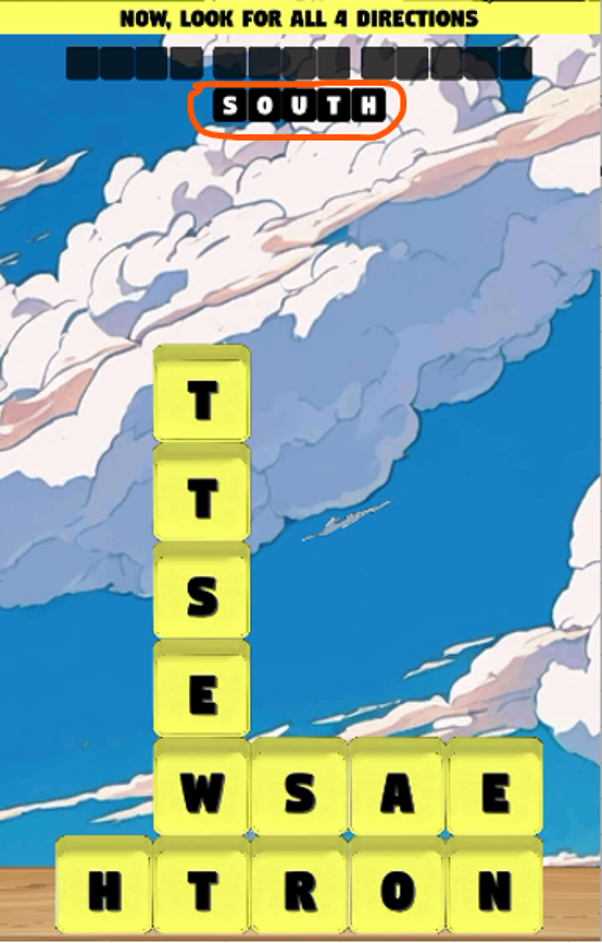
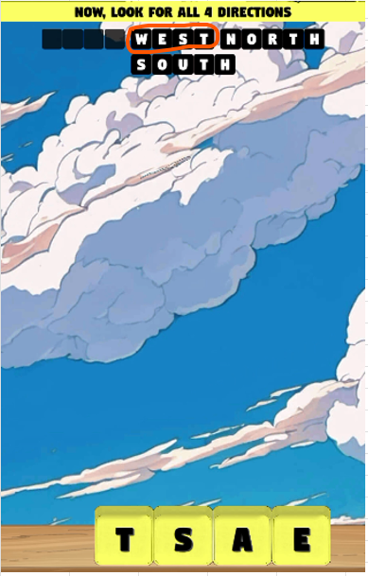

# Sheet3

Game First Interface, Loog at the red rounded circle, we have to make words for these

For example we have selected "SOUTH" highlighted in red circle

Now one word completed as highlighted in red circle, and the character "S" & "R" moved to down. Now after making a word structure is changed

Now I have selected "NORTH" from right to left

Now second word also completed as highlighted in red circle and structure also changed

Now I have selected "WEST" down to up as highlighted in red circle

You can see third word also completed as shown in red circle and structure is also changed

